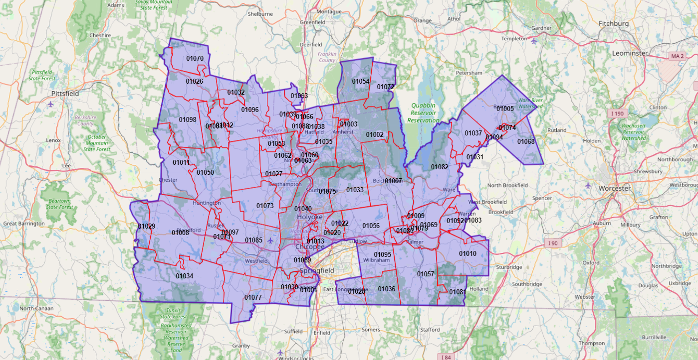

# ZCTA5 Simplifying and Merging  
Process, simplify, and merge 5-digit ZIP Code Tabulation Area (ZCTA5) GeoJSON data in the U.S.  
(What are ZCTAs?)[https://www.census.gov/programs-surveys/geography/guidance/geo-areas/zctas.html]  

# Download the Most Recent ZCTA5 Census Data With Jupyter Notebook  
(Download, Simplify, and Merge ZCTA5 into GeoJSON)[main.ipynb]  

# Rendering Showing An Example Mapping of a Final Simplified and Merged Region  
  

# References  
https://github.com/OpenDataDE/State-zip-code-GeoJSON  
https://github.com/jgoodall/us-maps  
